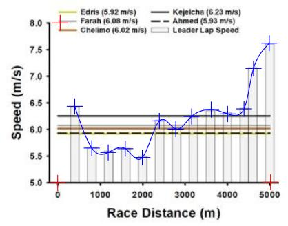
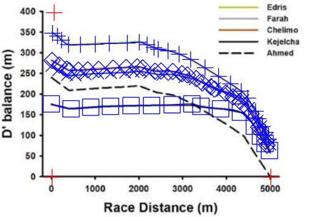

```{r setup, include=TRUE, echo=FALSE, message=FALSE, warning=FALSE}
#install.packages("devtools")
#devtools::install_github("brentscott93/kin697u")

if(knitr::is_html_output()){
 knitr::opts_chunk$set(
  echo = TRUE,
  message = FALSE,
  warning = FALSE
 ) 
 } else {
  knitr::opts_chunk$set(
  echo = FALSE,
  message = FALSE,
  warning = FALSE
 ) 
 }

if(!require("kin697u", character.only = TRUE)){
 devtools::install_github("brentscott93/kin697u")
}

library(tidyverse)
library(kin697u)
library(here)
library(cowplot)
library(ggpubr)
library(RColorBrewer)


```

```{r, library, message=FALSE, warning=FALSE, echo=FALSE, results='asis'}
if(!knitr::is_html_output()){
  cat(
    "**NOTE:** This is a lame PDF document. You *could* be reading the way cooler HTML version at [brentscott.us/kin697/deep-dive](https://brentscott.us/kin697/deep-dive) which has interactive code folding to view/hide the source code of the document."
  )
}

```


## Introduction

  The beauty of the sport of running is in its simplicity - the winner is the one who completes the distance in the least time. Interestingly, the objectively fastest runner does not always win the race despite previously having the fastest time for the given race distance. Moreover, even having measures of athletes' maximal oxygen consumption (VO^2^~max~), which is often used as a measure of cardio-respiratory fitness, is not sufficient information to solely predict distance runner performance. Additional exercise physiology laboratory tests can contribute to performance predictions by allowing for more control over the physiological variables that govern performance (lactate threshold, aneorobic power, etc.). Notably, in 1991 Michael Joyner used some of the physiological determinants of running performance (VO2max, lactate threshold, and running economy) to model and predict that a human could run a marathon in under 2 hours, almost 20 years before Eliud Kipchoge ran 1:59:40. Ultimately, the physiology underlying distance track races (\~800-10000m) performance is complicated as both aerobic and anaerobic energy pathways are utilized to meet the energy demands of the activity so the prediction of athletes' performances in these races becomes increasingly more complicated than compared to marathon distances where runners are exercising at intensities at or below their VO2max and lactate thresholds. Additional issues arise when addressing the concern of difficulty in providing training tools for coaches of high-school and collegiate athletes who do not have the time, money, or resources to readily measure all their athletes' physiological parameters in a laboratory setting. 
  
  The Critical Speed Model (CS-Model) has been proposed to provide reliable methods at predicting distance running performance (Jones 2017). The CS-Model uses linear regression to model an athlete's time (x-axis) by the respective race distance (y-axis). Since the CS-Model is linear, the equation is of familiar form, y = mx + b, where the slope (m) is the athlete's critical speed in meters/second, and the y-intercept (b) is referred to as "D' Prime" in meters. D' Prime is a measure of anaerobic performance and theoretically describes how far a runner can sustain a given pace that is above their critical speed. Once D' Prime has been utilized a runner's maximum speed that can be sustained is their critical speed, at least until D' Prime can become "reconstituted" or restored. More recently, a so-called "D' Balance Model" has been shown to be highly correlated with performance in track distance races (even more so than critical speed or D' Prime) (Kirby 2021). With these findings it was suggested that the "D' Balance Model" can become a useful tool for athletes and coaches to modify training and race preparations. However, the "D' Balance Model" has yet to be verified, replicated, or repeated outside the context of the original source. Additionally, for any potential tool to really be useful in practice it needs to be readily and easily accessible outside the scope of the original research. As such, here we sought to examine the replication of the "D' Balance Model" using the same 2017 World Championship Men's 5000m and 10,000m data, the repeatability of the model to predict the outcomes of other races (2020 Olympic Women's 5000m Final), and provide a potential framework for the future usability of the model for athletes and coaches.

## Methods

### Analysis

  Analysis of all data was performed using R (version 4.1.2) in RStudio (version 1.4.1717). Source code for this entire document is available <https://github.com/brentscott93/deep-dive-697>. This repository contains all data, code, and figures to replicate this document which was originally generated via [RMarkdown](https://rmarkdown.rstudio.com/). Core analysis functionality required to replicate the analysis, including both the Critical Speed Model and D' Balance calculations, have convenient wrappers available in the [{kin697u} R package which can be installed from Github.](https://github.com/brentscott93/kin697u) The {kin697u} package functions are used within this document as an example. Refer to the source code to see the internal working of the functions and package. The analysis of D' Balance is described further in the "Results" section.

### Replication of Kirby 2021 data

  In order to assess the replication of the "D' Balance Model" as utilized by the original authors, the publication figures from Kirby 2021 were digitized using *Engauge Digitizer* (Mitchell 2021) in order to best estimate the data values from Figure 1 in Kirby 2021. This provided us with more reliable and repeatable estimates than choosing "by-eye" for the values of lap speed for the 5k and 10k (Kirby Figure 1a and 1c), and for the D' Balance curves (Kirby Figure 1b and 1d). To digitize an image three axis points are selected as anchors (indicated as red "+") and the x-y coordinates are calibrated accordingly. Desired data values are selected (blue "+") and their values were estimated by the program and saved as .csv files in the project's directory. This was performed for each of the four panels in Figure 1 of Kirby 2021. Critical speed and D'Prime values were copied verbatim from Tables 1 and 2 in Kirby 2021.

```{r, digitized-iamges, fig.cap = paste("Digitized images from Kirby 2021. Red 'plus' signs indicate calibration points and blue markers are used to estimate data values."), fig.show='hold', out.width="50%"}


```

### Obtaining data from the 2020 Olympic Women's 5000m

  To provide more frequent lap splits than provided on the official race results (1000m), the 2021 Olympic Women's 5000m was streamed on [YouTube](https://www.youtube.com/watch?v=JX3ij39OAso) and lap splits were manually recorded. Unfortunately, the live broadcast did not always allow for consistent lap splits as other events or commercials interrupted the race coverage. Nonetheless, we were able to obtain reasonable estimation of lap distances, times, and race progression. The lap speed was calculated from the lap leader split by dividing the relative distance covered in meters by the relative time of the split in seconds.

```{r, womems-5k-data}
womens_5k <- 
  tribble(
  ~meter_mark, ~lap_distance_meters, ~time,
  200, 200,  "0:38.9",
  1000, 800, "3:00.67",
  1400, 400, "4:12.6",
  1800, 400, "5:25.2",
  2000, 200, "6:00.22",
  2200, 200, "6:36.6",
  2600, 400, "7:46.4",
  3000, 400, "8:59.81",
  3400, 400, "10:11.0",
  3800, 400, "11:21.9",
  4000, 200, "11:57.09",
  4200, 200, "12:31.5",
  4600, 400, "13:39.4", 
  4800, 200, "14:09.0",
  5000, 200, "14:36.79"
) %>% 
  mutate(
    seconds = to_seconds(time),
    split_time_seconds = seconds-lag(seconds, 1, default = 0),
    lap_leader_speed_meters_second = lap_distance_meters/split_time_seconds
  )

womens_5k %>% 
  dplyr::select("Distance (m)" = meter_mark, 
                "Lap Speed (m/s)" = lap_leader_speed_meters_second) %>% 
  mutate("Lap Speed (m/s)" = round(`Lap Speed (m/s)`, 2)) %>% 
  knitr::kable(caption = "2020 Olympic Women's 5k")
```

Critical speed and D' Prime were estimated for the top 4 finishers in the Women's 5000m by fitting the linear Critical Speed Model to the athlete's personal bests found on the internet (Wikipedia).

```{r}
womens_runners <- 
  tribble(
    ~athlete, ~distance_meters, ~time, 
    "Hassan", 800, "1:56",
    "Hassan", 1000, "2:34",
    "Hassan", 1500, "3:51",
    "Hassan", 1609, "4:12",
    "Hassan", 3000, "8:18",
    "Hassan", 5000, "14:22",
    "Hassan", 10000, "29:06",
    
    "Obiri", 800, "2:00",
    "Obiri", 1500, "3:57",
    "Obiri", 1609, "4:16",
    "Obiri", 3000, "8:20",
    "Obiri", 3218, "9:14",
    "Obiri", 5000, "14:18",
    "Obiri", 10000, "29:59",
    
    "Tsegay", 800, "1:59",
    "Tsegay", 1500, "3:54",
    "Tsegay", 5000, "14:13",
    "Tsegay", 10000, "29:39",
    
    "Tirop", 1500, "4:12.68",
    "Tirop", 3000, "8:22.92",
    "Tirop", 5000, "14:20.68",
    "Tirop", 10000, "30:25.20",
    
  
) %>% 
  mutate(seconds = to_seconds(time)) %>% 
  kin697u::calc_critical_speed()

womens_runners %>% 
  mutate(critical_speed_meters_second = round(critical_speed_meters_second, 2),
         d_prime_meters = round(d_prime_meters, 0)) %>% 
  dplyr::select("Athlete" = athlete, 
                "CS (m/s)" = critical_speed_meters_second,
                "D' (m)" = d_prime_meters) %>% 
  knitr::kable(caption = "2020 Olympic Women's Top Finishers CS/D'")
```

## Results

### Replication of Kirby 2021 data

  Ultimately, we were able to replicate the results from the D' Balance model presented in Kirby 2021 with the same 2017 World Championship data; however, the equations that were provided coupled with the lack of description for application of the equation made this a challenging task as we were initially unable to calculate similar results solely using the original text as guidance. Here, we outline several steps and propose the solution we came up with which permitted replication of the results. The D' Balance model as presented in Kirby 2021 is based on work from Skiba et al. 2015 and describes D'balance as: 

\begin{equation}
D' Balance = D'_{0} - D'_{exp} \cdot e^{ \frac{-D_{CS} \cdot t}{D'_0} }
\end{equation}

where D'~0~ is the initial D', D'~exp~ the expended D', D~CS~ is current speed minus the CS, and t is time in seconds. Additionally D'~exp~ is described as being:

\begin{equation}
D'_{exp} = D_{CS} \times t + D'_{prior}
\end{equation}

where D'~prior~ is the preceding D'. This is the extent of the original instruction with no mention of how this was iteratively implemented for every athlete on every split. Since D' Balance is the relationship between using (and draining) D' versus "reconstituting" (and gaining) D' we propose a model based on those of Kirby 2021 that is simply:

\begin{equation}
  D' Balance = 
 \begin{cases}
    D'_{drain}, & \text{if}\ Speed>CS \\
    D'_{gain}, & \text{else}
 \end{cases}
\end{equation}

This model describes that when the current running speed is greater than an athlete's critical speed they will be draining (i.e losing) D' and if the current running speed is slower than critical speed then the athlete can be gaining (i.e. "reconstiuting") their D'. Furthmore, the clarifiying use of the "if-else" cases provides useful intructions into how these equation can be programatically applied which is invaluable in the replication procedure. In this model D'~drain~ is simply a renamed form of the D'~exp~ term from Kirby 2021:

\begin{equation}
D'_{drain} = D_{CS} \times t + D'_{sol}
\end{equation}

where D~CS~ is the current lap speed minus the critical speed, t is the *relative lap time* (in seconds) and D'~sol~ is the currently available D` at the **S**tart **O**f **L**ap. Simply, the calculation of D'~drain~ describes the process of losing D' that is dependent on how great the speed is over the CS, how much D' there was to start with, and the duration of time spent at the speed.

D'~gain~ is of similar form to the originally proposed D' Balance equation and describes the process of recovering back D' when the speed is less than critical speed:

\begin{equation}
D'_{gain} = D'_{0} - D'_{expended} \cdot e^{ \frac{-D_{CS} \cdot t}{D'_0} }
\end{equation}

The important difference here is the introduction of D'~expended~ which is calculated by subtracting the D' currently available at the start of lap (D'~sol~) from the runner's initial D' value:

\begin{equation}
D'_{expended} = D'_0 - D'_{sol}
\end{equation}

With the above equations defined including the scenarios in which which specific case an equation should be used we were able to replicate the Kirby 2021 data from Figure 1.

```{r, kirby-replication-fig1, fig.width=10, fig.height=8, fig.cap="Replication of Kirby 2021 Figure 1. A&D) Lap speed throughout the races overlayed with athletes CS. B&C) Replication of the D' Balance model. Solid lines are the original data from the digitized images adn the dotted lines are the replicated results with the use of the new model presented here."}
runner_data_mens_5k <- 
  tribble(
    ~place, ~athlete, ~critical_speed_meters_second, ~d_prime_meters, ~fastest_5k_prediction_mmss, ~actual_finish_time_mmss, ~finish_time_behind_leader_mmss,
    1, "Muktar Edris", 5.92, 351, 13:05.1, 13:32.8, "00:00.0",
    2, "Mohammed Farah", 6.08, 268, 12:59.0, 13:33.2, "00:00.4",
    3, "Paul Chelimo", 6.02, 282, 13:03.9, 13:33.3, "00:00.5",
    4, "Yomif Kejelcha", 6.26, 175, 12:51.2, 13:33.5, "00:00.7",
    5, "Selemon Barega", NA, NA, NA, 13:35.3, "00:02.6",
    6, "Mohammed Ahmed", 5.99, 274, 13:08.2, 13:35.4, "00:02.6",
    7, "Aron Kifle", 5.98, 259, 13:13.2, 13:36.9, "00:04.1",
    8, "Andrew Butchart", 6.15, 148, 13:09.4, 13:38.7, "00:05.9",
    9, "Justyn Knight", NA, NA, NA, 13:39.2, "00:06.4",
    10, "Kemoy Campbell", 5.86, 243, 13:31.5, 13:39.7, "00:06.9",
    11, "Patrick Tiernan", 6.00, 167, 13:25.6, 13:40.0, "00:07.2",
    12, "Birhanu Balew", NA, NA, NA, 13:43.3, "00:10.50"
  ) 


# Estimated lap speeds from digitized graph
race_data_mens_5k <- 
  read_csv(here("data/kirby-fig1a.csv")) %>% 
  mutate(split = 1:nrow(.),
         lap_distance_meters = c(rep(400, 11), 200, 400))

      

d_balance_mens_5k <- calc_d_balance(runner_data_mens_5k, race_data_mens_5k)


filter_d_balance_mens_5k <- 
  d_balance_mens_5k %>% 
  filter(athlete %in% c("Muktar Edris", "Mohammed Farah", "Paul Chelimo", "Yomif Kejelcha")) %>% 
  mutate(source = "Replication")


kirby_d_balance_mens_5k <- 
  read_csv(here("data/kirby-fig1b.csv")) %>% 
  pivot_longer(cols = !x, names_to = "last_name", values_to = "d_balance") %>% 
  mutate(athlete = case_when(
                    last_name == "Edris" ~ "Muktar Edris",
                    last_name == "Farah" ~ "Mohammed Farah",
                    last_name == "Chelimo" ~ "Paul Chelimo",
                    last_name == "Kejelcha" ~ "Yomif Kejelcha"
                    ),
  total_race_distance_meters = x,
  source = "Digitized Original")

mens_5k <- bind_rows(filter_d_balance_mens_5k, kirby_d_balance_mens_5k)

mens_5k$athlete <- factor(mens_5k$athlete, levels = c("Muktar Edris",
                                                      "Mohammed Farah",
                                                      "Paul Chelimo",
                                                      "Yomif Kejelcha"))

plot_mens_5k <- 
  ggplot()+
  geom_line(data = mens_5k, 
            aes(total_race_distance_meters, 
                d_balance, 
                color = athlete, 
                linetype = source,
                size = source
                ))+
  scale_size_manual(values = c(0.5, 1))+
  ylab("D' Balance")+
  xlab("Race Distance (m)")+
  ggtitle("5k Replication of Kirby 2021 Figure 1B")+
    scale_color_manual(name = "Athlete", values = brewer.pal(4, "Dark2"))+
    scale_linetype(name = "Data Source")+
    scale_size_manual(values = c(0.5, 1), guide = "none")+
  theme_cowplot(12)


#######################################################
runner_data_mens_10k <- 
  tribble(
    ~place, ~athlete, ~critical_speed_meters_second, ~d_prime_meters,
    1, "Mohammed Farah", 6.08, 268,
    2, "Joshua Cheptegei", 6.07, 250,
    3, "Paul Tanui", 6.14, 164,
    4, "Bedan Karoki", 6.06, 214,
    5, "Jemal Yimer", NA, NA,
    6, "Geoffrey Kamworor", 6.01, 316,
    7, "Abadi Hadis", 5.99, 317, 
    8, "Mohammed Ahmed", 6.00, 274,
    9, "Shadrack Kipchirchir", 6.09, 113,
    10, "Andamlak Belihu", NA, NA,
    11, "Aron Kifle", 5.98, 259,
    12, "Abraham Cheroben", NA, NA,
    13, "Leonard Korir", 6.02, 165,
    14, "Timothy Toroitich", 6.03, 101,
    15, "Hassan Mead", 5.95, 228
 ) 

race_data_mens_10k <- 
  read_csv(here("data/kirby-fig1c.csv")) %>% 
  mutate(split = 1:nrow(.),
         lap_distance_meters = 400)

race_data_mens_10k$lap_leader_speed_meters_second[[nrow(race_data_mens_10k)]] <- 7.2

kirby_d_balance_10k <- 
  read_csv(here("data/kirby-fig1d.csv")) %>% 
  pivot_longer(cols = !x, names_to = "last_name", values_to = "d_balance") %>% 
  mutate(athlete = case_when(
    last_name == "Farah" ~ "Mohammed Farah",
    last_name == "Cheptegei" ~ "Joshua Cheptegei",
    last_name == "Tanui" ~ "Paul Tanui",
    last_name == "Karoki" ~ "Bedan Karoki" 
  ),
  total_race_distance_meters = x,
  source = "Digitized Original")


d_balance_mens_10k <- calc_d_balance(runner_data_mens_10k, race_data_mens_10k)


filter_d_balance_mens_10k <- 
  d_balance_mens_10k %>% 
  filter(athlete %in%  c("Mohammed Farah", "Joshua Cheptegei","Paul Tanui", "Bedan Karoki" )) %>% 
  mutate(source = "Replication")


mens_10k <- bind_rows(filter_d_balance_mens_10k, kirby_d_balance_10k)

mens_10k$athlete <- factor(mens_10k$athlete, levels = c("Mohammed Farah",
                                                        "Joshua Cheptegei",
                                                        "Paul Tanui",
                                                        "Bedan Karoki"
                                                      ))

plot_mens_10k <- 
  ggplot()+
    geom_line(data = mens_10k, 
              aes(total_race_distance_meters, 
                  d_balance, 
                  linetype = source,
                  color = athlete,
                  size = source
              ))+
    ylab("D' Balance")+
    xlab("Race Distance (m)")+
    ggtitle("10k Replication of Kirby 2021 Figure 1D")+
    scale_color_manual(name = "Athlete", values = brewer.pal(4, "Dark2"))+
    scale_linetype(name = "Data Source")+
    scale_size_manual(values = c(0.5, 1), guide = "none")+
    theme_cowplot(10)
    


######################

all_rep <- imap_dfr(list("5k" = d_balance_mens_5k, "10k" = d_balance_mens_10k), ~mutate(.x, race = .y))

all_rep$race <- factor(all_rep$race, levels = c("5k", "10k"))
rep_all_athletes <-
  ggplot()+
  geom_line(data = all_rep, 
            aes(total_race_distance_meters, 
                d_balance, 
                color = athlete,
            ))+
  facet_wrap(~race, scales = "free_x")+
  ylab("D' Balance")+
  xlab("Race Distance (m)")+
  ggtitle("Replication of all athletes D' Balance")+
  scale_y_continuous(breaks = seq(-200, 350, by = 50))+
  scale_color_manual(name = "Athlete", values = c(brewer.pal(8, "Dark2"), brewer.pal(9, "Set1"), "black"))+
  theme_cowplot()+
  theme(
    strip.background = element_rect(fill = "black" ),
    strip.text = element_text(color = "white"),
    panel.border = element_rect(color = "black", size = 1.2)
  )


race_data_mens_5k$meter_mark <- c(seq(400, 4400, by = 400), 4600, 5000)
cs_data_overlay_5k <- filter(runner_data_mens_5k, 
                          athlete %in% c("Muktar Edris", "Mohammed Farah", "Paul Chelimo", "Yomif Kejelcha"))

lollipop_5k <- 
ggplot()+
  geom_hline(data = cs_data_overlay_5k,
             aes(yintercept = critical_speed_meters_second, color = fct_reorder(athlete, critical_speed_meters_second)))+
  geom_segment(data = race_data_mens_5k,
               aes(x = meter_mark,
                   xend = meter_mark, 
                   y = 0, 
                   yend = lap_leader_speed_meters_second),
               size = 1)+
  geom_point(data = race_data_mens_5k, 
             aes(x = meter_mark, 
                 y = lap_leader_speed_meters_second), 
             size = 9,
             shape = 21,
             fill = "grey15",
             stroke = 1.5)+
  
  geom_text(data = race_data_mens_5k, 
            aes(x = meter_mark, 
                y = lap_leader_speed_meters_second,
                label = round(lap_leader_speed_meters_second, 2)),
            size = 3,
            color = "white")+
  ylab("Lap Speed (meters/second)")+
  xlab("Distance (meters)")+
  ggtitle("Men's 5k")+
  coord_cartesian(ylim = c(5, 8))+
  scale_y_continuous(expand = expansion(c(0, 0.1)))+
  scale_x_continuous(breaks = race_data_mens_5k$meter_mark)+
  scale_color_manual(name = "Athlete Critical Speed", values = brewer.pal(4, "Dark2"), guide = guide_legend(reverse=TRUE))+
  theme_cowplot(10)+
  theme(
    axis.text.x = element_text(angle = 45, hjust = 1),
    legend.position = c(0.1, 0.7)
  )
 

race_data_mens_10k$meter_mark <- seq(400, 10000, by = 400)
cs_data_overlay_10k <- filter(runner_data_mens_10k, 
                              athlete %in%  c("Mohammed Farah", "Joshua Cheptegei","Paul Tanui", "Bedan Karoki" ))

lollipop_10k <- 
ggplot()+
  geom_hline(data = cs_data_overlay_10k,
             aes(yintercept = critical_speed_meters_second, color = fct_reorder(athlete, critical_speed_meters_second)))+
  geom_segment(data = race_data_mens_10k,
               aes(x = meter_mark,
                   xend = meter_mark, 
                   y = 0, 
                   yend = lap_leader_speed_meters_second),
               size = 1)+
  geom_point(data = race_data_mens_10k, 
             aes(x = meter_mark, 
                 y = lap_leader_speed_meters_second), 
             size = 8,
             shape = 21,
             fill = "grey15",
             stroke = 1.2)+
  
  geom_text(data = race_data_mens_10k, 
            aes(x = meter_mark, 
                y = lap_leader_speed_meters_second,
                label = round(lap_leader_speed_meters_second, 2)),
            size = 3,
            color = "white")+
  ylab("Lap Speed (meters/second)")+
  xlab("Distance (meters)")+
  coord_cartesian(ylim = c(5.7, 7.2))+
  scale_y_continuous(expand = expansion(c(0, 0.1)))+
  ggtitle("Men's 10k")+
  scale_x_continuous(breaks = race_data_mens_10k$meter_mark)+
  scale_color_manual(name = "Athlete Critical Speed", values = brewer.pal(4, "Dark2"), guide = guide_legend(reverse=TRUE))+
  theme_cowplot(12)+
  theme(
    axis.text.x = element_text(angle = 45, hjust = 1),
    legend.position = c(0.1, 0.7)
  )


top <- plot_grid(lollipop_5k, plot_mens_5k, nrow = 1, labels = c("A", "B"))
bottom <- plot_grid(lollipop_10k, plot_mens_10k, nrow = 1, labels = c("C", "D"))
middle <-  plot_grid(plot_mens_5k,
                     plot_mens_10k,
                     nrow = 1,
                     labels = c("B", "C"),
                     rel_widths = c(0.45, 0.55))

plot_grid(lollipop_5k, middle, lollipop_10k, nrow = 3, labels = c("A", "", "D"))
```


### Repeatability with the 2020 Olympic Women's 5000m

  Once we described the equations and procedure above we implemented the functionlity into an R package [{kin697u}](https://github.com/brentscott93/kin697u) which provides convenient wrapper functions in order to increase to reproducibility of our proposed model. Using our R package we performed the same analysis using data from the 2020 Olympic Women's 5000m. 


```{r, womens_5k, fig.width=9, fig.height=5, fig.cap="Results from 2021 Olympic Women's 5000m. A) Lap speed throughout the duration of the race. B) Critical speed an D' table. C) D' balance model. Lines colored to represent ultimate finish position."}
d_balance_womens_5k <- kin697u::calc_d_balance(womens_runners, womens_5k)

d_balance_womens_5k$athlete <- factor(d_balance_womens_5k$athlete, levels = c("Hassan", "Obiri", "Tsegay",  "Tirop"))

plot_womens_5k <- 
  plot_d_balance(d_balance_womens_5k)+
  scale_color_manual(values = c("gold", "grey50", "darkorange", "black"))+
  ggtitle("2021 Olympic Women's 5000m")


womens_runners$athlete <- factor(womens_runners$athlete, levels = c("Hassan", "Obiri", "Tsegay",  "Tirop"))

plot_womens_5k_lollipop <-
    plot_lollipop_race(womens_runners, womens_5k)+
    scale_color_manual(name = NULL, values = c("gold", "grey50", "darkorange", "black"))+
    coord_cartesian(ylim = c(4, 7.3))+
    ggtitle("2021 Olympic Women's 5000m")+
    theme(
      axis.text.x = element_text(angle = 45, hjust = 1),
      legend.position = c(0, 0.9),
      legend.direction = "horizontal"
    )

womens_5k_table <- 
  womens_runners %>% 
  dplyr::select(Athlete = athlete,
                "CS (m/s)" = critical_speed_meters_second,
                "D' Prime (m)" = d_prime_meters) %>% 
  mutate(across(where(is.numeric), ~round(., 2))) %>% 
  ggpubr::ggtexttable(theme = ttheme("light"))

  
womens_bottom <- cowplot::plot_grid(womens_5k_table, plot_womens_5k, nrow = 1, labels = c("B", "C"))

cowplot::plot_grid(plot_womens_5k_lollipop, womens_bottom, nrow = 2, labels = c("A", ""))

```

  The results from the 2020 Olympic Women's 5000m suggest that the Bronze medalist (Tsegay) should have had potential for a silver medal. There could be several explanations for this result, one being the simulations assume all runners are at the same place (meter mark) at the same time and do not take in account distance from leader at start of each lap. 


### Future usability of the model

  So far we have shown that with slight modifications the D' Balance Model can be replicated and repeated with relatively good performance at predicting the finishing position as was shown by Kirby 2021. Despite the advances in reproducibility made thus far with the implementation of the R package, this analysis still remains un-accessible to the average runner or trainer (unless they are also an R programmer). To decrease the entry barrier for performing this analysis we created a web-browser based application, LAME, using the R-Shiny framework (Chang et al. 2021) to provide an easy-to-use graphical user interface (GUI) which provides a "point-and-click" experience for novice users that leverages the abilities of our {kin697u} R package. LAME is a recursive acronym which stands for Lame Application for Maximizing Endurance. LAME can be accessed at [https://brentscott93.shinyapps.io/LAME](https://brentscott93.shinyapps.io/LAME). The application comes with "Demo" data built-in that allows visitors to preview the features of the app without needing to take time to fill out the necessary information. Ultimately, LAME provides an example of how the D' Balance and Critical Speed model can be offered to the general public which increases the reality of using these analyitcs as real-life training tools.
 
## Conclusions & Final Remarks

  While I spent a considerable time on this project, I probably should have spend less time coding/building an app and **more** time writing/doing the actual assignment. But, it was fun. 
  
  
## References
  
Jones, A. M., & Vanhatalo, A. (2017). The ‘Critical Power’ Concept: Applications to Sports Performance with a Focus on Intermittent High-Intensity Exercise. Sports Medicine, 47(1), 65–78. https://doi.org/10.1007/s40279-017-0688-0

Joyner, M. J. (1991). Modeling: Optimal marathon performance on the basis of physiological factors. Journal of Applied Physiology, 70(2), 683–687. https://doi.org/10.1152/jappl.1991.70.2.683

Kirby, B. S., Winn, B. J., Wilkins, B. W., & Jones, A. M. (2021). Interaction of exercise bioenergetics with pacing behavior predicts track distance running performance. Journal of Applied Physiology, 131(5), 1532–1542. https://doi.org/10.1152/japplphysiol.00223.2021

Mark Mitchell, Baurzhan Muftakhidinov and Tobias Winchen et al, "Engauge Digitizer Software." Webpage: http://markummitchell.github.io/engauge-digitizer, Last Accessed: December 16, 2021

Skiba, P. F., Fulford, J., Clarke, D. C., Vanhatalo, A., & Jones, A. M. (2015). Intramuscular determinants of the ability to recover work capacity above critical power. European journal of applied physiology, 115(4), 703-713.

Winston Chang, Joe Cheng, JJ Allaire, Carson Sievert, Barret Schloerke, Yihui Xie, Jeff Allen, Jonathan McPherson, Alan Dipert and Barbara Borges (2021). shiny: Web Application Framework for R. R package version 1.7.1. https://CRAN.R-project.org/package=shiny