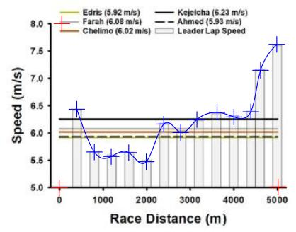
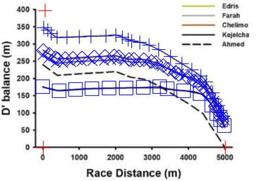

## Introduction

  The beauty of the sport of running is in its simplicity - the winner is the one who completes the distance in the least time. Interestingly, the objectively fastest runner does not always win the race despite previously having the fastest time for the given race distance. Moreover, even having measures of athletes' maximal oxygen consumption (VO^2^~max~), which is often used as a measure of cardio-respiratory fitness, is not sufficient information to solely predict distance runner performance. Additional exercise physiology laboratory tests can contribute to performance predictions by allowing for more control over the physiological variables that govern performance (lactate threshold, aneorobic power, etc.). Notably, in 1991 Michael Joyner used some of the physiological determinants of running performance (VO2max, lactate threshold, and running economy) to model and predict that a human could run a marathon in under 2 hours, almost 20 years before Eliud Kipchoge ran 1:59:40. Ultimately, the physiology underlying distance track races (~800-10000m) performance is complicated as both aerobic and anaerobic energy pathways are utilized to meet the energy demands of the activity so the prediction of athletes' performances in these races becomes increasingly more complicated than compared to marathon distances where runners are exercising at intensities at or below their VO2max and lactate thresholds. Additional issues arise when addressing the concern of difficulty in providing training tools for coaches of high-school and collegiate athletes who do not have the time, money, or resources to readily measure all their athletes' physiological parameters in a laboratory setting. 
  The Critical Speed Model (CS-Model) has been proposed to provide reliable methods at predicting distance running performance (@Jones2017). The CS-Model uses linear regression to model an athlete's time (x-axis) by the respective race distance (y-axis). Since the CS-Model is linear, the equation is of familiar form, y = mx + b, where the slope (m) is the athlete's critical speed in meters/second, and the y-intercept (b) is referred to as "D' Prime" in meters. D' Prime is a measure of anaerobic performance and theoretically describes how far a runner can sustain a given pace that is above their critical speed. Once D' Prime has been utilized a runner's maximum speed that can be sustained is their critical speed, at least until D' Prime can become "reconstituted" or restored. More recently, a so-called "D' Balance Model" has been shown to be highly correlated with performance in track distance races (even more so than critical speed or D' Prime) (@kirby2021). With these findings it was suggested that the "D' Balance Model" can become a useful tool for athletes and coaches to modify training and race preparations. However, the "D' Balance Model" has yet to be verified, replicated, or repeated outside the context of the original source. Additionally, for any potential tool to really be useful in practice it needs to be readily and easily accessible outside the scope of the original research. As such, here we sought to examine the replication of the "D' Balance Model" using the same 2017 World Championship Men's 5000m and 10,000m data, the repeatability of the model to predict the outcomes of other races (2020 Olympic Women's 5000m Final), and provide a potential framework for the future usability of the model for athletes and coaches.  
  
## Methods
Analysis of all data was performed using R (version 4.1.2) in RStudio (version 1.4.1717). Source code for this entire document is available {HEEEEEEEEEEEEEEEEEEEEEEEEEEERE}.
 
### Replication of Kirby 2021 data
  
  In order to assess the replication of the "D' Balance Model" in the same context utilized by the original authors, the publication figures from Kirby 2021 were digitized using _Engauge Digitizer_ (Winchen et al.) in order to best estimate the data values from Figure 1 in Kirby 2021. This provided us with more reliable and repeatable estimates than choosing "by-eye" for the values of lap speed for the 5k and 10k (Kirby Figure 1a and 1c), and for the D' Balance curves (Kirby Figure 1b and 1d). 
  
```{r}

```
  
  
To digitize an image three axis points are selected as anchors (indicated as red "+") and the x-y coordinates are calibrated. Desired data values are selected (blue "+") and their values are estimated and saved as .csv files. This was performed for each of the four panels in Figure 1 of Kirby 2021.  Critical speed and D'Prime values were copied from Tables 1 and 2 in Kirby 2021.


```{r}

```

### Repeatability with data from 2020 Olympic Women's 5000m

  In order to provide more frequent lap splits than provided on the official race results (1000m), the 2021 Olympic Women's 5000m was streamed on YouTube (https://www.youtube.com/watch?v=JX3ij39OAso) and lap splits were manually recorded. Unfortunately, the live broadcast did not always allow for consistent lap splits as other events or commercials interrupted the race coverage. Nonetheless, we were able to obtain reasonable estimation of lap distances, times, and race progression. 
  Critical speed and D' Prime were estimated for the top 4 finishers in the Women's 5000m by fitting the linear Critical Speed Model to the athlete's personal bests found on the internet (Wikipedia). 
  
### Future usability of the model

 A web-browser based application was created using the R-Shiny framework (Chang et al. 2021) and provides an easy-to-use graphical user interface (GUI) for point-and-click interaction for novice users. An additional command line interface (CLI) is provided in the R-package {KIN697} accessible. The web app and R-package are free and open source. Code is available here and here. 
 
 
## Results

### Replication of Kirby 2021 data

```{r}
#install.packages("devtools")
#devtools::install_github("brentscott93/kin697u")
library(kin697u)
library(here)
library(cowplot)
library(ggpubr)
library(RColorBrewer)
```


 


 
